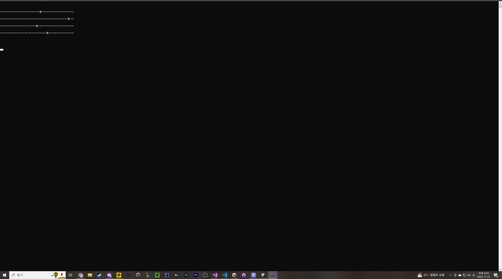

# 황선율 포트폴리오

## SnakeGame
- 언어: C#  

-객체지향 언어인 C#을 사용해서 객체지향적으로 Snake Gmae을 콘솔로 재작

## HorseRacingGame
- 언어: C  

-정렬 알고리즘과 함수를 이용해서 경마게임을 콘솔로 제작

## calculator
- 언어: C#
- 
- 프레임워크:WPF  

-WPF로 간단한 계산기 제작

